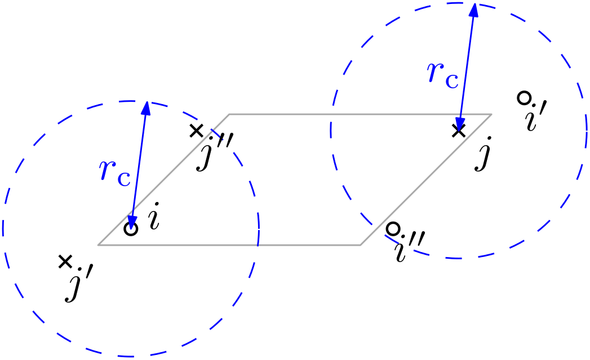

.. _representations:

Representations
===============

In this section, we summarize the representations implemented in Rascal.

.. contents::
   :local:

Pair distances
**************

SphericalInvariants
*******************

Behler-Parinello symmetry functions
***********************************

Based on [Behler2007]_

Voronoi representation
**********************

Coulomb matrices
****************

Derivatives of Representations
*******************************

Consider a quantity :math:`Q(\{l_i\})` which depends on a number of degrees of freedom :math:`\boldsymbol l = \{l_i\}` and can be written as a sum

.. math::
   Q(\boldsymbol l) = \sum_j q_j(\boldsymbol l).

The derivative of this quantity with respect to any degree of freedom :math:`l_k` then becomes

.. math::
   \frac{\partial Q}{\partial l_k} = \sum_j\frac{\partial q_j}{\partial l_k},

where the dependence on :math:`\boldsymbol l` has been dropped for simplicity :math:`Q = Q(\boldsymbol l)`. Assume furthermore that :math:`Q` arises from short-range interatomic interactions (i.e., no Coulomb forces).

For atomic degrees of freedom (e.g., positions, momentum, but not e.g., volume, box tilt angle, etc) we can use the short-range assumption by defining the neighbourhood :math:`N_j` which is the set of all atoms close enough to atom :math:`j` to interact with it. We can then rewrite above equation in the convenient form

.. math::
   \frac{\partial Q}{\partial l_k} = \frac{\partial q_k}{\partial l_k} + \sum_{j\in N_j}\frac{\partial q_j}{\partial l_k}.

As a practical implementation note, the cross terms :math:`\partial q_j/\partial l_k` can in many cases be stored as by-products of computing the derivatives :math:`\partial q_i/\partial l_i`, meaning that one single loop over every atom with a nested single loop over each of its neighbours from a half-neighbour-list is sufficient to compute all terms. Note that while the atom :math:`k` is a 'normal' center atom, the :math:`j`-atoms can be center atoms, or could be ghost atoms (images of atoms due to periodic boundary conditions or domain decomposition).

Note regarding periodic boundary conditions on small simulation boxes
---------------------------------------------------------------------

In small periodic simulation boxes, the short-range cutoff radius can be large enough to have an atom or its periodic images (ghosts) appear multiple times in a neighbourhood, see the figure below.

In this situation, the neighbourhood of atom :math:`j` is :math:`N_j = \{i', i''\}`, containing twice the ghost of atom :math:`i`, similarly, :math:`N_i = \{j', j''\}`.

Following the approach outlined above, the derivative of :math:`Q` with respect to the position :math:`x_j` of atom :math:`j` is

.. math::
    \frac{\partial Q}{\partial x_j} =\frac{\partial q_j}{\partial x_j} + \sum_{k\in N_j}\frac{\partial q_k}{\partial x_j}= \frac{\partial q_j}{\partial x_j} + \frac{\partial q_{i'}}{\partial x_j} + \frac{\partial q_{i''}}{\partial x_j}.

Now, it may look surprising to consider separately the derivatives of the ghost terms :math:`q_{i'}` and :math:`q_{i''}`, since periodicity clearly requires that these quantities are in reality just the quantity :math:`q_i`. One might wish to express this explicitly and write the derivative rather as:

.. math::
   \frac{\partial Q}{\partial x_j} = \frac{\partial q_j}{\partial x_j} + \left.\frac{\partial q_{i}}{\partial x_j}\right|_\mathrm{pbc} \quad \text{under periodic boundary conditions,}

which is, of course, correct as well. However, the quantity :math:`\partial q_i/\partial x_j|_\mathrm{pbc}` becomes, when written out,

.. math::
   \left.\frac{\partial q_{i}}{\partial x_j}\right|_\mathrm{pbc} = \frac{\partial q_i}{\partial x_{j'}} + \frac{\partial q_{i}}{\partial x_{j''}},

the right-hand side terms of this last equation are simply the periodically shifted expressions of the terms

.. math::
   \frac{\partial q_{i}}{\partial x_{j'}} = \frac{\partial q_{i''}}{\partial x_{j}},\quad \frac{\partial q_{i}}{\partial x_{j''}} = \frac{\partial q_{i'}}{\partial x_{j}}.

Check the figure to convince yourself. We can thus substitute this result back into the periodic formulation,

.. math::
    \frac{\partial Q}{\partial x_j} = \frac{\partial q_j}{\partial x_j} + \left.\frac{\partial q_{i}}{\partial x_j}\right|_\mathrm{pbc} =  \frac{\partial q_j}{\partial x_j}+ \frac{\partial q_i}{\partial x_{j'}} + \frac{\partial q_{i}}{\partial x_{j''}} =  \frac{\partial q_j}{\partial x_j}+ \frac{\partial q_{i''}}{\partial x_{j}}+\frac{\partial q_{i'}}{\partial x_{j}}

We now have recovered the initial formulation, where we did not pay any special consideration to the periodic boundary conditions. This result is general. We can conclude that it is mathematically valid, but practically unnecessary to consider periodic boundary conditions as a special case.
